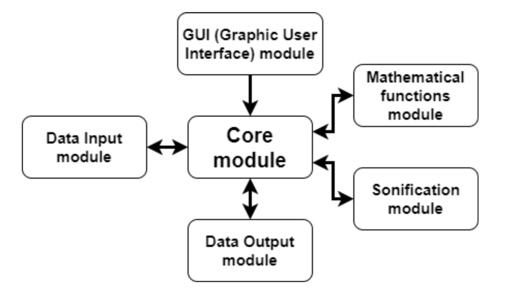
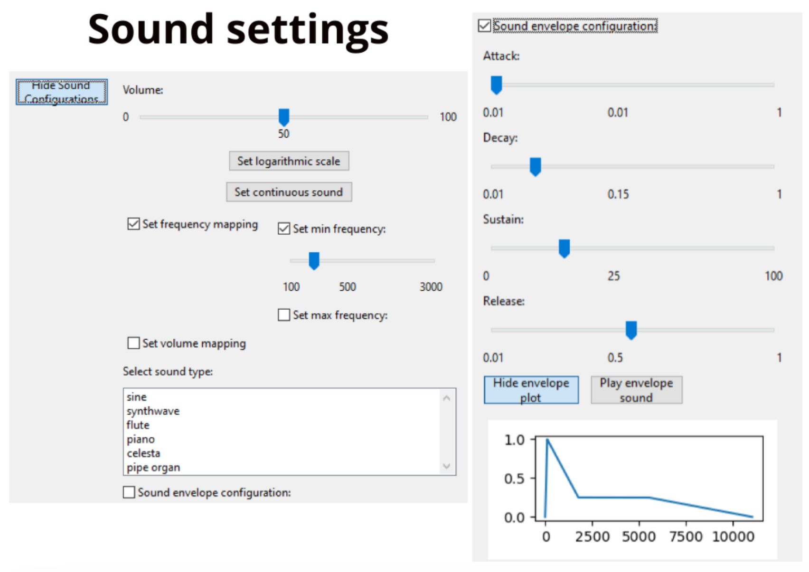
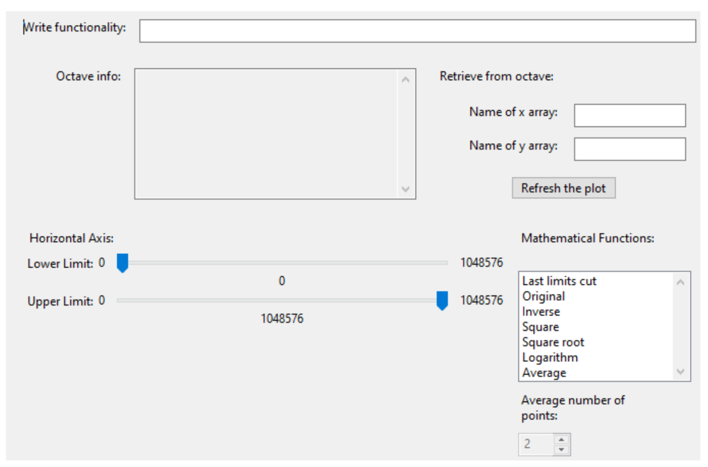
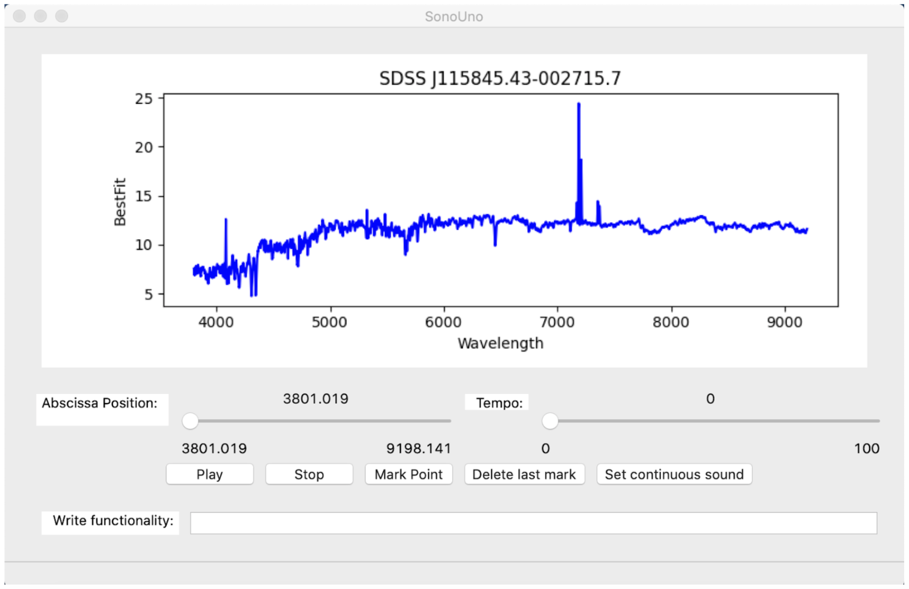
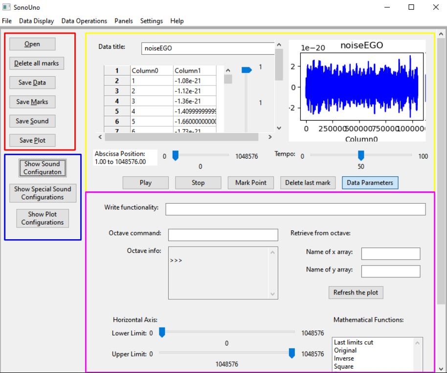
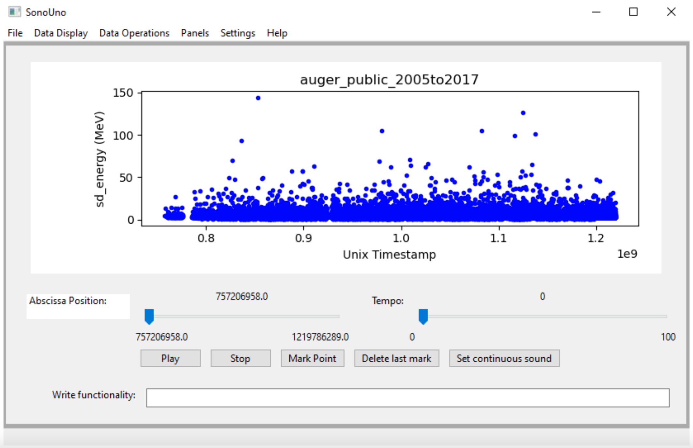
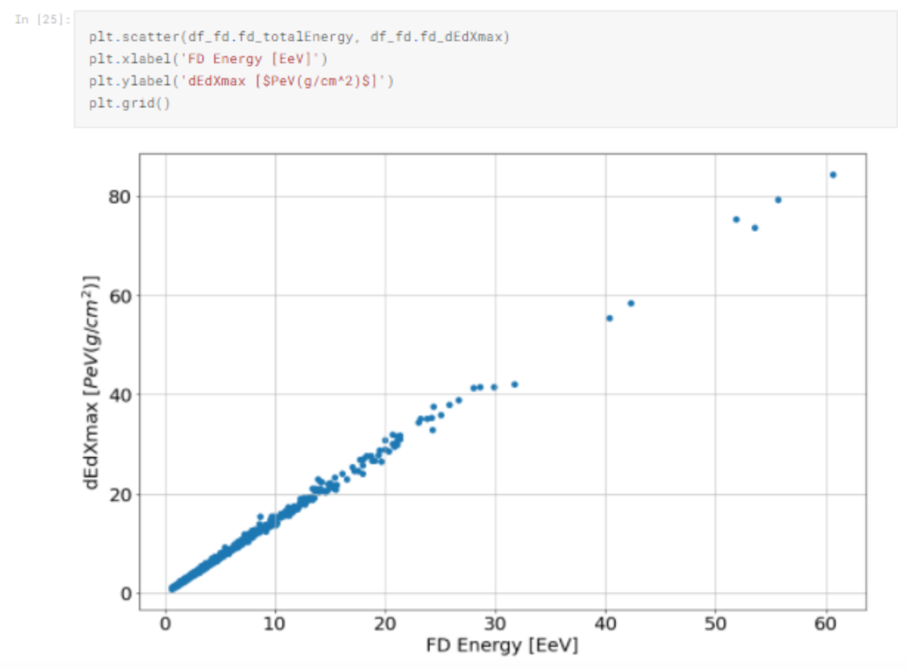
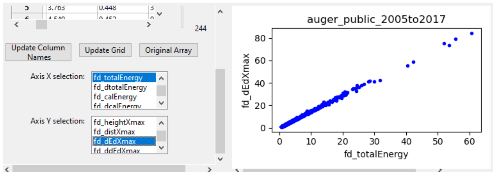

# Summary

The sonification field has grown continuously over the recent years, especially since 1992 with the International Community for Auditory Display-ICAD conferences. Sonification is by definition the use of non-speech audio to translate data into sound, in this case, a sonification software, sonoUno, and its application in astronomy are presented, without neglecting the analysis possibilities for data from various disciplines. The differences between the present development from others are: it is user centred from the beginning, with several contacts with end users along the design and a focus group test; it seeks a way to bring autonomy to its functional diverse users; and it presents a simple first framework, with the mathematical operations and settings in the menu. A description of the software, the impact on the design after end users' contacts, its functionalities, and some specific applications using different sets of astrophysical datasets are presented.

In general, people think about information and nature based on a visual approach, but what if we go back to our childhood and try to understand the world through our different senses? In this contribution a new way to face astrophysical data is presented, emphasizing the possibility of multisensorial scientific work.

# Introduction

The human being by nature explores the world through all his senses, however, there is a marked predominance in the use of visual displays to make sense of data sets under study. This is the case in astronomy,  even with evidence of the benefits of the auditory display as a complement to visual display [@wandatesis2013].

The use of sonification in astronomy has existed for years, some recent examples are a sonification of the zCOSMOS astronomical dataset, where the authors describe the dataset and the sonification strategy used [@bardellietal2021]; the LightSound, an electronic device that allows the conversion of light into sound and it is used to observe eclipses [@lightsound2020]; See-Through-Sound, a project dedicated to converting images into sound to allow visually impaired people to detect objects around them [@henriquesetal2014]; R-Scuti, an audio-visual installation that proposes the conversion of astronomical data from the AAVSO (American Association of Variable Star Observers) database into an exhibition environment, using recordings of variable star observations [@laurentizetal2021]; and an accessible science lab, research that highlights the need for multimodal approaches in teaching and learning environments, presenting principles for inclusive material design based on user-centred design and universal design for teaching environments [@reynagaetal2020].

Nevertheless, in most cases, the sonification mapping of the dataset was defined by its creator and shared as a final product, not clearly devoted to research. The ICAD conference intended to bring together multidisciplinary experts working in this field of sonification, since its creation in 1992, in its repository there are a lot of works that [@andreopoulouYgoudarzi2021] grouped into six categories (sonification methods, sonification tools/system, review/opinion, exploratory, perception/evaluation studies and other). This systematic review of the ICAD repository highlights a high percentage of papers devoted to sonification methods and tools, in contrast to a low percentage of papers devoted to design methodologies, perception studies, and evaluation methods. It is alarming that the perception studies present a growth between 2005-2009, but decreased by under 1% to 2019; even when [@fergusonYbrewster2017] point out the importance of perception studies in auditory displays and report some psychoacoustic parameters and talk about how people perceive it. 

In this sense and taking into account the increasing examples of sonification in astrophysics, sonoUno aims to provide an open-source platform that allows users to open different datasets, and explore them through visual and auditory display, the last permitting to adjust visual and sound settings to enhance their perception. This project is user centred from the beginning, to reach that goal at first the ISO 9241-171:2008 standard was used to analyse the accessibility of three previous software [@ise2a2017; @ijskd2022] and construct the first Graphic User Interface (GUI) mock-up; second, a theoretical framework centred on visual disability was designed and applied to the software in development [@casadoetal2019], the consequent ISO analysis to sonoUno show very good results. Finally, a focus group session was conducted with people with and without visual disabilities to test the first version of sonoUno, some recommendations and updates arise from that study [@casadoFG2022]. In this contribution, the final version and architecture of sonoUno were explained and the new functionalities are tested with astronomical data sets.

# Previous works

The number of projects using sonification to represent astrophysical data has grown enormously over the last 10 years. @zanella2022, after an international sound workshop held in August 2021, created a repository with existing software until December 2021, which yields a result of 98 projects developed since 1962, many of them discontinued, with lack of documentation or without evidence of applications in science. Almost 80% of the sonification projects have been carried out between 2011 and 2021. Until 2017, the date on which this sonification software development began, only 50% of the software included in the mentioned repository had started its development.

{ width=70% }

Take into consideration that \autoref{fig:fig1} does not contain all the developments that use data sonification, it was adopted as an eligibility criterion, especially for recent years, that the software was related to astronomy and that had a graphical user interface (with the exception of Python packages or libraries). In that sense, \autoref{fig:fig1} contains the developments devoted to being used on the computer desktop, they need to be installed on the computer, with the difficulties that it represents. From \autoref{fig:fig1} only StarSound, STRAUSS, and Astronify present updates during the last three years.

StarSound is a sonification software for astronomical and astrophysical data, such as light curves and spectrograms, it was developed by Jeffrey Cooke, Jeffrey Hannan, and Gary Foran (a visually impaired astronomer) [@starsound2022]. It accepts as input two-column table data (1D), which can be plotted on an x-y coordinate axis. It contains a sound synthesizer with a graphic user interface that allows the manipulation of its parameters. Said interface presents the elements in different tabs. This development has taken into account accessibility features during its design, the parameters of the sound synthesizer can be configured in a text file that can be opened and modified using a screen reader. In addition, it comments on the existence of keyboard shortcuts, through which its graphical interface can be used.

Strauss is a recent development, it presented its first updates on GitHub two years ago [@straussGithub]. It is a Python package, developed with the purpose of improving accessibility in the current visual display of data. It presents the possibility of being used by people without knowledge in sound or programming, through predefined examples and using the default settings. However, it presents documentation that allows its use at a more advanced level allowing the modification of the sound parameters. The direct application of this development is the "Audio Universe" project, in which they have recently published a tour of the solar system. @strauss2021 explain how this tour was developed using different instruments for each planet, in addition to the sound settings configuration to represent the distance and position of each object.

Astronify is based on sonification data from observations made by telescopes, particularly this development has been carried out by the Space Telescope Science Institute operated by AURA [@astronify], the third satellite of NASA's Earth Observation System. It is a package that is currently in active development, it sonify time series data, specially light curves. It is a library written in Python that can be imported into this development environment and used to perform the sonification. Its website has a link to GitHub, videos that describe and show the sound, tutorials, multimedia material, and a game. The latter has two levels and presents different characteristics of a light curve. Said game could be compared with a training activity, which serves to instruct the community in the multimodal analysis of light curves. However, there is no documentation that indicates if this is really the intention of this project and if it is really recording the contributions of users who play the game.

Over the past few years the offer of sonification software has grown, each one with its own characteristics. In the case of sonoUno, it was decided to maintain it as user centred as possible, contacting people every year or after each software update.

# SonoUno development

## User centred framework

Since 2019, with the first version of sonoUno, contact with end users began. In April 2019, a focus group session took place at Southampton University [@casadoFG2022], nine people with and without visual disability used the program following a list of tasks and, then, they answered some questions related to the graphic and sound display. From that study, not only bugs and possible updates arise but also highlight the need for user centred design that takes into consideration the different learning styles. One important statement of the visually impaired participants was that sonoUno allows them to explore, in contrast with the actual tools available at that moment.

Contacts with end users, during the focus group session, and some sonoUno tests queries sent by email (where the questions are centered on some aspects of usability and if some new functionality is needed), helps to solve some bugs and updates in sonoUno making it more user centred [@iau367; @casadoFG2022]. One of these updates was the changing of the sound library to pygame, because of its maintenance and due to the fact that it was one of the few libraries that present tools to reproduce sound by tones making it possible to attend to the graphic user interface needs (user interaction while the sound is playing), in addition, to save the same sound in a file format like wav. This action also solves a bug found with the continuous instruments using the Mingus library during the focus group session.

During testing sonoUno with their own datasets some users report a problem with data points imported as NaN, which happens when not all columns present the same length. The new update detects data sets with NaN values and if after it there is no other number, the software takes it as the end of the reproduction. Another bug arises using a data set that contains the same value during all the ‘y’ axis (or second column), that’s because the normalization function uses the maximum and minimum subtraction in the denominator, so in this particular case, the normalization function try to divide by zero and through an error message. Right now before the normalization SonoUno checks if the maximum and minimum values of the column was the same or not, if they are the same, sonoUno reproduces the same tone during all values.

During different tests with light curves of variable stars, another bug was pointed out, sonoUno reproduces all the data points with the same silence between them, giving the feeling that all points are equidistant. Today, sonoUno corresponds the silence between tones with the space between data points, an example of this functionality can be seen in the Sensing the Dynamic Universe \href{https://lweb.cfa.harvard.edu/sdu/eclipsingbinaries.html}{web page}, which uses sonoUno mainly for educational purposes. Besides, it was pointed out the importance of a loop function to analyze some data sets, this function was added as a command to write in the ‘write functionalities’ element displayed in the main framework.

Some end users notice that the saved sound doesn't maintain the same sound parameters set by them during the sonification. This was solved with another important update, the reproduction of the point where the red bar points out when it changes its position (the last was recommended several times during the tests). Last but not least, a first approach to multiple and simultaneous data sonification/visualization was designed and presented in this contribution.

During the process of development and maintenance, some pattern data is used to test the different stages, all data are astronomical data obtained from public domains (Sloan Digital Sky Survey (SDSS) database and Pierre Auger Observatory for example) or international collaborations (like REINFORCE\footnote{Project (GA 872859) with the support of the EC Research Innovation Action under the H2020 Programme SwafS-2019-1 the \href{https://www.reinforceeu.eu/}{REINFORCE}}).

## SonoUno Design and Implementation

About the tools used to develop sonoUno, Python is a high-level programming language, open source, multiplatform, object-oriented, and presents a fast learning curve. There are a lot of libraries developed for \href{http://python.org}{Python}, and many groups or organizations make an oversize effort to maintain these libraries and to program new ones. This last feature makes Python a great choice for open-source projects, the Python community presents a very high commitment to maintaining and developing resources.

The libraries used in this project are: \href{http://wxpython.org}{wxPython} (an open source toolkit to generate cross platforms graphic user interfaces, it presents many years of development and an active work team, the last release was in August 2022; \href{http://pandas.pydata.org}{pandas} (an open source and very powerful tool devoted to data analysis and manipulation); matplotlib (allows the generation of 2D plots from a data set [@blackholehunter] and present an easy integration with wxPython); \href{http://numpy.org/}{numpy} (it is a fundamental package to scientific computing); and \href{http://pygame.org/wiki/about}{pygame} (primarily devoted to video games include modules to generate graphics and music), sonoUno project used the music module of this library). All libraries present years of maintenance and are widely used. The actual sound library and implementation on sonoUno produce sound from its sinusoidal parameters, each data point on the dataset produces a differentiated tone. This was decided based on the sound and graphic representation of each data point, ensuring, at first, the correlation between the two human sensory styles. SonoUno software's principal aim is research through sonification, it is very important to understand and correlate sonification with visualization (the actual practice to research in astronomy) in conjunction with a deeper analysis of human sound perception.

Once the libraries were selected, the modular design was chosen for the software, the development tasks were divided into different modules, in order to organize the job and make the cooperative work between the team easier. Each module has predefined inputs and outputs to communicate the different modules. In the case of sonoUno, the modules are Data Input, Data Output, Data Transformation, Sonification, Graphic User Interface design, and Core (see \autoref{fig:fig2}).

{ width=70% }

### Data Input Module

This module allows the user to select a data set on the file system and place the data in a Python variable, using Numpy and Pandas libraries. To do this, the module asks for the address where the file is located and differentiates the name and the extension of the file. Then, using a conditional statement with the file extension, the specific method for each type of file is called (txt and csv at the moment). In this module, new lines of code can be implemented to read more types of data files, the only demand is to put the data in a pandas.DataFrame format to send it to the Core Module.

At this moment, the software reads all columns of the data, in the case of more than two columns, the first two are selected by default to generate the plot and a dedicated panel allows users to change between the different columns. The data to be imported can be separated by "," or ";" in the case of .csv files, and tabulation or space in the case of .txt files.

### Sonification module

In the first stages of SonoUno using the Mingus library, MIDI sound was produced, to do that the fluidsynth synthesizer was used, but it presented limitations of range and the installation was complicated, differing between operative systems. To solve the range problem and look for a form to play sound attending the GUI needs, the sound library was changed to pygame. It was designed to produce video games, for that works very well with sound and graphic interaction.

Sound is generated using a synthesizer approach, meaning the instrument tone is approximated by combining sinusoidal waveforms of relevant frequencies. At the same time, the characteristic time progression is achieved by the well-known ADSR (Attack Decay Sustain Release) envelope. This is enough to synthesize a variety of tones, which are also customizable by the user, and which frequencies are not limited to specific notes, but can play at any frequency in an essentially continuous spectrum. This design was decided somewhat in the spirit of the Moog synthesizers, from the late 1960s, in the sense that modules and filters can be added and configured by the users to create sounds that better represent the data they want to transmit to the listener.

There is a great advantage of being able to represent, by sound, any value and present very small differences. It must be taken into account, nevertheless, that this freedom is limited by the maximum audible frequencies of the user, e.g.: if two variables are being sonorized at the same time, it is done using two different “voices”, which are characterized by distinct harmonic composition. If the fundamental frequency range reaches enough high frequencies, the harmonics that differentiate the voices could reach frequencies too high for the listener to hear (properly, that is), rendering both voices indistinguishable, beating the whole purpose of using different instruments.

{ width=70% }

It is important to highlight that the software allows one to control and set all the sound parameters, it presents a settings section that is displayed in a panel at the left of the graphic display, containing buttons and slider bars, allowing to customize the frequency, volume, sound type and even the envelope waveform (\autoref{fig:fig3}).

### Mathematical functions module

This module encompasses the mathematical operations that sonoUno allows, by the moment it includes simple operations (like inverse, square, square root, logarithm, and smooth), horizontal axis cuts, and provides an octave bridge (\autoref{fig:fig4}).

{ width=70% }

The list of mathematical functions are operations previously preprogrammed and the user could apply them only by selection. In the case of x-axis cut, there are two slider bars to select the minimum and maximum value for the new range of x-axis; also it can be done by writing a command on the Write functionality text box (\autoref{fig:fig5}, section 1), this allows more precision and a faster way to do it.

Finally, the octave bridge allows the application of octave functions to the dataset, here the oct2py library is being used. From sonoUno, when the dataset is opened, it is sent to octave automatically. Then, the user can apply octave functions to the data considering that the column name in SonoUno is the array name in octave. All operations are performed in the octave domain, if the user wants to plot the arrays into sonoUno again, they have to use the retrieve from octave section (section 3 in \autoref{fig:fig5}), indicating the x-axis name and y-axis name and pressing the button ‘Refresh the plot’.

{ width=70% }

### Data Output module

This module allows the user to save a plot, the actual data plotted, the sound, and the marks made on the data opened in the software. The plot is a two-dimensional graphic, the actual data plotted can be stored in a csv file, the sound is a wav file produced with the same data and parameters of the software, and the marks are coordinates stored by the user with a button saved in a csv file.

This module asks the user where to store the data on the file system and detects the type of data to be stored depending on the button pressed by the user. Then, it saves the specific file on the user's computer or shows a message if there were a problem with the process.

### Graphic User Interface module

This section began with a mock-up design and over the years has been changing until the ultimate framework (\autoref{fig:fig6}). The different sections of the GUI are: the menu at the top of the windows, the data display panel shown at the principal framework with the write functionality text element, the octave section (display the output of each octave command, it is placed under the write functionality element into the mathematical functions panel (\autoref{fig:fig7} at top of pink rectangle)), the data parameter panel (placed at the left of the principal display (\autoref{fig:fig7} at left inside yellow rectangle), display the grid with the data opened and ‘x-y’ axis select option), the cut sliders and mathematical function panel (placed at the bottom of the GUI (\autoref{fig:fig7} pink rectangle)), the input/output buttons panel (open and save, placed al the left-top of the GUI (\autoref{fig:fig7} at red rectangle)) and the configuration panel divided into sound and graphic setting (placed under the previous panel (\autoref{fig:fig7} at blue rectangle)) (It could be reproduced the next video to follow a detailed explanation: \href{https://youtu.be/7mYvU7OaTUA}{here}).

## GUI and sound tests with data from the Pierre Auger Observatory
\label{sect:pierreauger}

As an example of use of sonoUno for discrete data, there will be presented the application of the software to a cosmic rays data set, obtained from \href{https://opendata.auger.org/}{Pierre Auger Observatory}). The webpage of Pierre Auger presents information about the observatory and an open data section. The CSV file for the analysis was extracted from the zip file downloaded from the Pierre Auger web page and is available \href{https://bit.ly/3yf2hNw}{here}. This CSV file was opened directly with the sonoUno desktop version, to the plot in \autoref{fig:fig8} ‘gpstime’ was selected as ‘x-axis’ and ‘sd_energy’ as ‘y-axis’, the titles of each axis, and the general plot was changed inside the program using the text entry element from ‘data parameters’ panel.

A little portion of the x-axis can be selected using the slider bars in the data operation panel, in addition, the commands ‘xlowerlimit(number)’ and ‘xupperlimit(number)’ can be used in the write functionality text entry to obtain the same result. \autoref{fig:fig9} shows an example with a lower limit at 1124471483 [Unix Timestamp] and an upper limit at 1125034238. 

{ width=70% }

In addition to the dataset, The Pierre Auger web page, displays a link to the \href{https://opendata.auger.org/analysis.php}{Analysis of the Data} examples. Particularly, the correlation plot obtained with the ‘fd_dEdXmax’ vs ‘fd_totalEnergy’ columns was extracted and shown in \autoref{fig:fig10}. In \autoref{fig:fig11}, the same axis was chosen inside sonoUno for the plot, in order to compare, it can be seen that the graph is the same in both cases.

# Discussion

As a first result after the use of sonoUno in its triple functioning: graphic deployment, sonorization of the data, and use of mathematical function, we observe that the tool is sufficient for the purpose of the inclusion in general: a) it is possible to deploy data sets in the same way that the proposed by the data owners; b) the sonification is precise and detects the data features, permitting: marking over the plot, changing intervals, volume, pitch, frequency and adapting the output to the perception of each user; c) it is possible to apply mathematical functions to the data: predetermined (smooth, logarithmic, square, between others) or using a line of commands communicated with the octave program. The output of the software: graph, sound, marks, and data plotted, can be saved and reopened for future or more detailed analysis, even using another tool.

In addition, modular design allows programmers to work on different modules and the final integration works properly. Furthermore, the graphic user interface was modified according to the user testing activities following a user centred design framework from the beginning. The software test with Pierre Auger dataset (\autoref{sect:pierreauger}) plots the same graph of the example downloaded from the web page of Pierre Auger, the sound takes too much time because the sonification method reproduces data point by data point and there are near 30000 data points in this data set. Remember this tool is centered in data analysis, so it is needed to investigate if quicker sonification methods is useful to it, and what is the better approach to produce it.

According to @wandatesis2013, sonification could enhance the actual data display and, @iau367;@casadoFG2022’s work reinforces that assumption. In addition, in the previous section, it was shown that astronomical datasets could be displayed in sonoUno in the same form as other visualization tools, with the benefit of sonification and allowing it to be used by people with different learning styles.

# Conclusions

The use of sound to communicate, detect or analyze data features has been used for many years, but the use of sonification (use of sound to represent data) formally began in the 90s. Maybe, it is too early to compare it with the visual display, especially since we have used visual tools for centuries and learned about visual display since elementary school, but the first approach to sound display usually occurs when people already have a degree or as a consequence of a disability. Perception studies and an earlier approximation to this technique are needed.

It is important to mention that our experience shows that the use of more than one sense improves the detection of specific features in the data. In any case and in order to acquire a deep comprehension of multimodal analysis, training courses are needed. Besides, in order to know the sonification process better and investigate how it can be used in the research field, new sound perception experiments need to be done, with available tools like sonoUno and with different datasets, including the input of sound.

The authors expect to encourage more people to help with future steps and software maintenance, taking into account that this development is completely open source and the sonification technique is part of the new approach to the study of nature.

# Acknowledgements

The authors want to give their thanks to the people who tested the tool, participated in the training activities, and shared their experiences, ideas, suggestions, and comments. The contributions and feedback of Julieta Carricondo Robino, Aldana Palma, Carlos Morales Socorro, Richard Green, Poshak Gandhi, Gaston Jaren, Southampton Sight, students at the University of Mendoza and ITeDA, and many volunteers at the Focus Groups and beyond testing the software are deeply appreciated. In addition, thanks to IAU Office of Astronomy for Development-SAAO-South Africa and the University of Southampton for all their support to this development.

This work was funded by the National Council of Scientific Research of Argentina (CONICET) and has been performed partially under the Project REINFORCE (GA 872859) with the support of the EC Research Innovation Action under the H2020 Programme SwafS-2019-1.

# References
